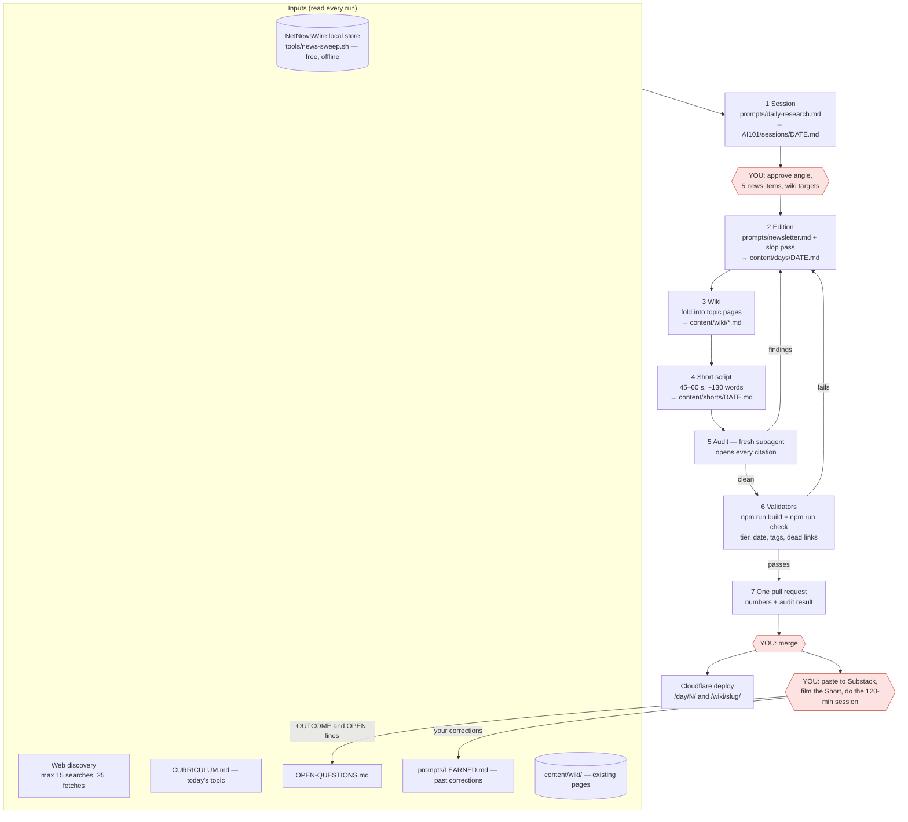

# Workflow — one day, one command

`/daily` does the whole day. You are the only human, at three points (the red boxes).
The previous three-block version is in `archive/WORKFLOW-v1.md`.

## Budget (Claude Pro, 5-hour window)

Pro gives roughly 10–40 agentic prompts per rolling 5-hour window, plus a weekly cap.
`/daily` runs on Sonnet with a hard cap of 15 searches, 25 fetches and one audit
subagent, which should fit one window with room left. The simulation's two audit
subagents alone used 169,537 tokens, so never run more than one. Run `/daily` in
a fresh session; do not use Opus for it. One `/daily` run is the only heavy job in a window. Keep other work out of the
same window. Monthly: prune `LEARNED.md` by hand, moving repeated rules into
the prompt they belong to.
