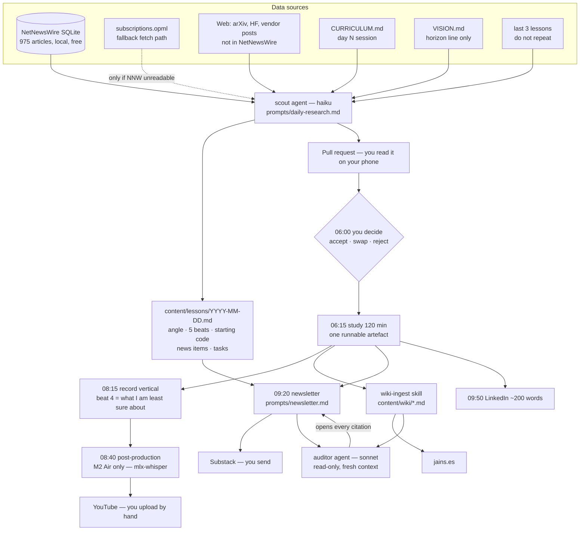
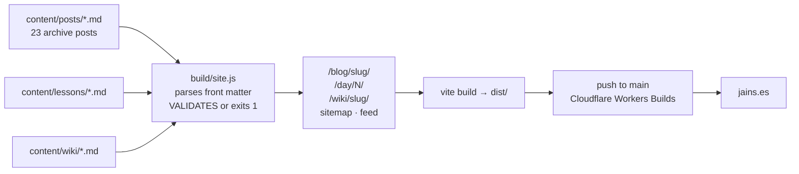
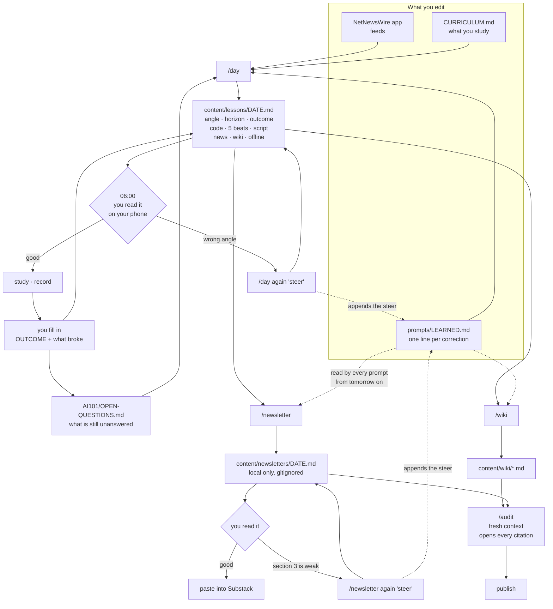

# Workflow — how a day runs

British English throughout. Maintained by Claude Code on the Mac mini.
This file is the map: what fires, what reads what, which prompt, which
skill, and what comes out. `PLAN.md` is the design; this is the wiring.

Week 1 every box is run by hand. Week 2 the shaded boxes become a
`launchd` job. Nothing in week 1 depends on automation existing.

---

## The five locks

The newsletter is not negotiable on these, whatever else changes:

1. **Global South focus** — India and Africa first, then the rest.
2. **Five-minute read on a phone.** ~900–1,100 words. Hard ceiling.
3. **Gen Z to boomer.** One register that a 17-year-old and a 68-year-old
   both finish. ESL-first.
4. **No emoji.**
5. **Our voice and our sourcing discipline** — `BLOGGING.md` tiers, every
   claim a dated resolvable link, no "experts say".

---

## Diagram 1 — where information comes from and where it goes



**Read it as:** one study session feeds four outputs. Nothing is
researched twice. The auditor never wrote the draft, which is the whole
reason it can catch a fabricated citation.

---

## Diagram 2 — build and publish



The build **fails** rather than shipping an unsourced claim. That is
already true for the 23 posts and it extends unchanged to lessons and
wiki pages.

---

## Data sources — what each one is for

| Source | Where | Role | Cost |
|---|---|---|---|
| NetNewsWire DB | `~/Library/Containers/com.ranchero.NetNewsWire-Evergreen/.../OnMyMac/DB.sqlite3` | Daily news sweep. One `sqlite3` query, offline, dated, deduped | £0, 0 tokens |
| `sources/subscriptions.opml` | repo | Fallback if the sandboxed DB is unreadable from `launchd` | £0 |
| `sources/SOURCES.md` | repo | The only place sources are configured. Adding a line changes tomorrow | £0 |
| Web fetch | scout | Anything NetNewsWire cannot reach: arXiv, Hugging Face, vendor posts, primary filings | tokens |
| `CURRICULUM.md` | repo | Day N session | £0 |
| `VISION.md` | repo | One `horizon:` line per day. Never taught directly | £0 |

NetNewsWire is **one** source, not the only one. Its AI folder is thin —
three feeds, one of them a dead Google News search. The six additions in
Q9 go in through the app so iCloud keeps them.

---

## Prompts — which, when, reading what

| Prompt | Fires | Reads | Writes |
|---|---|---|---|
| `prompts/daily-research.md` | 05:00 | SOURCES, NetNewsWire, curriculum day N, last 3 lessons, VISION horizon | `content/lessons/<date>.md` + a pull request |
| `prompts/newsletter.md` | 09:20 | today's lesson file, today's news items, last 5 newsletters | newsletter draft, you edit |
| `wiki-ingest` skill | 10:05 | today's artefact and sources | `content/wiki/*.md`, cross-linked |
| `wiki-lint` skill | Sunday | whole wiki | contradictions, orphans, stale claims |
| `wiki-audit` skill | before any page goes evergreen | one page + its sources | every footnote checked against its source |
| `no-ai-slop` skill | on every draft | the draft | edits |

---

## Agents and skills

Two agents, as settled. Everything else is a skill or a hook.

| | Model | Context | Why it is a separate agent |
|---|---|---|---|
| **scout** | haiku | `omitClaudeMd`, 15 turns, web + Write | High-volume output nobody re-reads |
| **auditor** | sonnet | `omitClaudeMd`, read-only | A context that did not write the draft cannot rationalise it |

Wiki page, newsletter, script and LinkedIn post are written in **one
context, one pass**. Splitting them produces four drafts that disagree
about what the story is.

---

## The newsletter — Jollof Bytes structure, our discipline

Daily. Global South. ~900–1,100 words, five minutes on a phone. No emoji.

| # | Section | Length | Sourcing bar |
|---|---|---|---|
| 1 | Masthead — date, reading time, subscribe | 1 line | — |
| 2 | **What happened** — 5 items, AI and tech, Global South relevance first | 2–3 sentences each | Full `BLOGGING.md` tiers. Dated link, opened and confirmed |
| 3 | **The intersection** — one item on AI meeting ordinary life, work or money | ~120 words | Full tiers |
| 4 | **Made / making** — art, craft, creative commentary. 2–3 days a week, not daily | ~100 words | Marked commentary, links where they exist |
| 5 | **What I learned yesterday** — 3–4 bullets from the lesson, one of them what I got wrong | ~120 words | Own work |
| 6 | **Useful** — one tool, prompt or term explained plainly, or one opportunity applicable from home | ~80 words | Link required |
| 7 | **Number of the day** — one statistic | 1–2 lines | Primary source or it is cut |
| 8 | Sign-off, one question, invitation to reply | 1 line | — |

Sections 2, 6 and 7 carry the full sourcing discipline. Sections 3 and 4
are **clearly marked as commentary**, which is what makes them safe to
write and what makes them the moat — nobody else pairs a sourced AI brief
with creative commentary for this audience.

Section 5 is small on purpose. The teaching lives on the site and in the
video; in the newsletter it is a few bullets, not a lecture.

**Beat 4 of the video stays** — "the part I am least sure about" is the
mitigation for a beginner teaching in public. It shrinks to one bullet in
section 5 rather than owning a section of its own.

---

## Where your three files land

| File | Goes to | Why |
|---|---|---|
| `master ai vision .md` | `AI101/VISION.md` | Horizon layer. Read for the `horizon:` line, never taught directly |
| `AI Newsletter Generation Prompt + reference.md` | `AI101/prompts/newsletter.md`, archived block at the top | The record of what the prompt was before. The new prompt sits under it |
| `Subscriptions-iCloud.opml` | `AI101/sources/subscriptions.opml` | Fallback fetch path, and a diffable record of the feed list |

`user_files_inspect/` is deleted once these three have moved.

---

## Week 1 — eight pull requests, in order

Each branches off the previous so `main` stays deployable. Items 3, 6 and
7 carry screenshots in the pull request body — light and dark, phone
width — because a CSS diff tells you nothing on a phone.

| PR | What | Notes |
|---|---|---|
| 1 | Fold AI101 in. Repo goes public | Resume and `.DS_Store` do not come across. Stale `INCIDENT_REPORT.md` deleted. `jpysh/AI101` archived |
| 2 | Rewrite `CLAUDE.md`, under 200 lines | Reverses only the signup prohibition, with the reason recorded |
| 3 | New homepage, agency to `/work/`, build `/about` | Fixes `/#work` and `/#contact` in `build/site.js`, which 23 pages link to |
| 4 | `/privacy` | Twelve lines. No cookies, no analytics, Cloudflare and Substack named |
| 5 | Substack signup embedded | Homepage and `/subscribe` only. Articles stay zero-JS |
| 6 | Light and dark, system default, toggle | `#e6e6e6` on `#16181c`. Toggle on JS-bearing pages only |
| 7 | Reading typography, article pages to zero JS | Decouples `styles.css` from `src/main.js` first — today CSS ships only as a side-effect of the JS bundle |
| 8 | Wiki page type in `build/site.js` | `tags`, `prereqs`, `related` as comma-separated strings. No YAML dependency |

Then stop. Week 2 is agents, hooks, `launchd` and the video pipeline,
after you have published a few lessons by hand.

---

## Three things I need to tell you before PR 1

1. **The newsletter is now a ~45–60 minute job, not 30.** Jollof's
   structure needs five sourced news items, an intersection piece, a
   number and an opportunity — that is research, not a rewrite of the
   lesson file. `RUNBOOK.md` budgets 30 minutes. Either the runbook moves
   to 60, or section 4 goes weekly and section 2 drops to three items.
   My recommendation: **run it at 60 minutes for two weeks and measure**,
   then cut. Do not guess now.

2. **The Substack embed costs the zero-JS promise on the pages that carry
   it.** It is a third-party iframe: Substack's JavaScript, Substack's
   cookies, and `frame-src https://*.substack.com` opened in the CSP.
   Contained to the homepage and `/subscribe`. Articles and wiki pages
   never carry it.

3. **`/privacy` changes because of point 2.** An embedded Substack iframe
   does set third-party cookies, so the page says so plainly and links
   Substack's policy. Still no banner: the cookies are Substack's, on
   their frame, and you set none.

---

## The control surface — what you edit, and where

Six things you touch. Everything else is generated from them.

| You edit | Controls | How often |
|---|---|---|
| **NetNewsWire app** | Which feeds get swept | When something stops earning its place |
| **`AI101/CURRICULUM.md`** | What you study, day by day | When a week proves too fast or too slow |
| **`content/lessons/<date>.md`** | Today's angle, beats, script, outcome | Every morning, 06:00 |
| **`AI101/prompts/LEARNED.md`** | Every prompt's behaviour, permanently | Daily, one line |
| **`AI101/prompts/*.md`** | How things are written | Rarely |
| **`AI101/OPEN-QUESTIONS.md`** | What you did not understand yet | After a session |
| **`AI101/sources/SOURCES.md`** | Scout-only sources | Weekly |

Feeds are configured **in the NetNewsWire app**, not in `SOURCES.md`. The app
syncs through iCloud and the sweep reads its local store, so adding a feed
there is the whole action. `SOURCES.md` records the list and configures the
sources the scout fetches itself — arXiv, GitHub, vendor pages — which
NetNewsWire never sees.

---

## Diagram 3 — the edit and re-run loop



**Read it as:** you never hand-patch generated prose. You steer and it
regenerates, and **every steer is appended to `LEARNED.md`**, which every
prompt reads from the next run onwards. That is the difference between
correcting the same thing forty times and correcting it once.

Hand-editing still works — everything is Markdown on disk, and `git diff` shows
exactly what a re-run would overwrite for anything tracked. But the steer is the
loop that compounds.

**Newsletter drafts are gitignored.** They stay on your machine; the prompts and
commands that write them are public. The sent version is public on Substack, so
nothing is hidden that matters — only the hours between draft and send.

---

## Re-run semantics

| Command | Re-run form | Keeps | Regenerates |
|---|---|---|---|
| `/day` | `/day again "<steer>"` | Your edited angle and horizon | Code, beats, script, news |
| `/newsletter` | `/newsletter again "<steer>"` | Nothing — it is cheap | The whole draft |
| `/wiki` | `/wiki again` | Pages at `stage: evergreen` | Seedling and budding pages |
| `/audit` | idempotent | — | Report only, never edits |

`/day again` never overwrites the angle or the horizon, because the angle is the
one judgement with no verifiable success criterion and it belongs to the person
whose name is on it.

It also never writes `## OUTCOME`. You write that after the session — one line
on what you can now do that you could not that morning. An outcome written by
the agent that planned the session is not evidence of anything, and `/sunday`
reads the week's outcomes to decide whether the curriculum is running fast or
slow. That is the only correction signal the curriculum gets.

---

## `LEARNED.md` — the flywheel

One line per correction, dated, appended automatically by any `again` command
and by hand whenever something annoys you.

```
2026-09-24 | newsletter | Section 2 items keep leading with the valuation.
                          Lead with what a reader pays or does differently.
2026-09-25 | script     | 800 words is 9 minutes when read aloud, not 6.
                          Target 600.
2026-09-26 | day        | Stop proposing sessions that need a GPU. The mini
                          cannot train. Kaggle or the M2 Air only.
```

Every prompt reads it. It is the only file in the project that is allowed to
grow without being pruned, because it is the record of what the system got
wrong and the reason it stops doing so.
