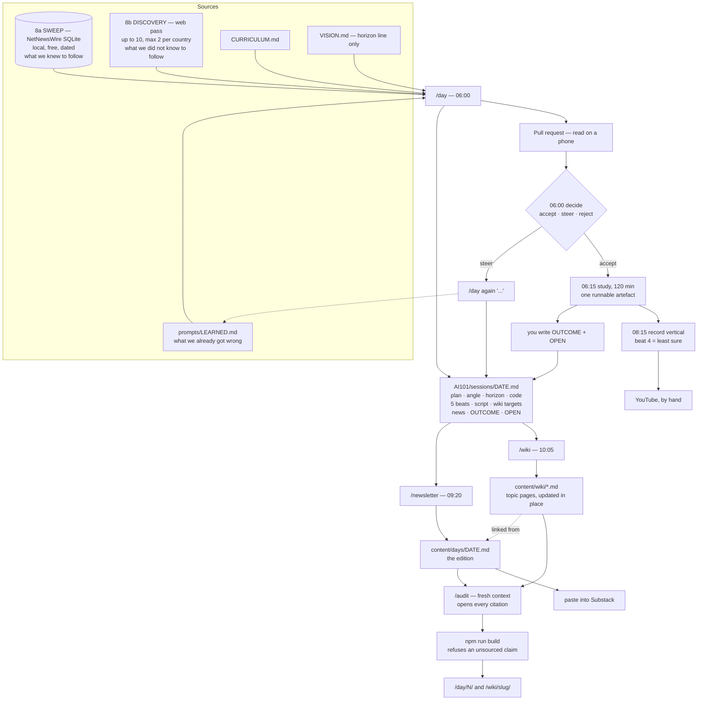
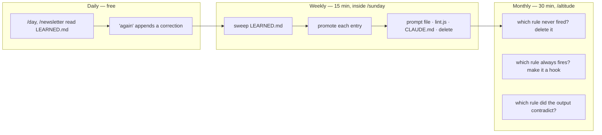
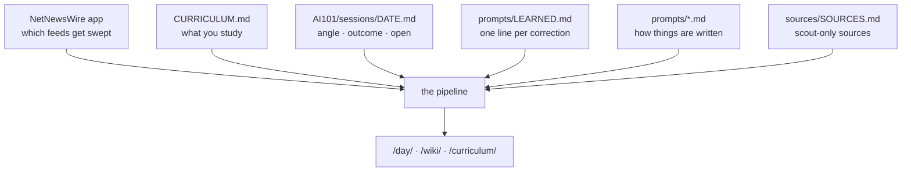

# Workflow — how a day runs

British English throughout. Maintained by Claude Code on the Mac mini.
This file is the map: what fires, what reads what, which prompt, which skill,
and what comes out. `PLAN.md` is the design; this is the wiring.

Week 1 every box is run by hand with a slash command. Week 2 the overnight
ones become a `launchd` job. Nothing in week 1 depends on automation existing.

---

## Two surfaces, and why

| Surface | What it is | Half-life |
|---|---|---|
| **`/day/<n>/`** | The edition. News, the intersection, what I got wrong | A day |
| **`/wiki/<slug>/`** | The topic. Deep dive, accretes as the learning does | Years |

Everything else is navigation: `/` , `/curriculum/`, `/about/`, `/privacy/`,
`/work/`.

The daily session is **not** a page. Nobody needs to know what was studied on
a Tuesday. Its learning is folded into the topic page it belongs to, which is
where a reader looking for tokenisation actually looks. The session file lives
in `AI101/sessions/`, committed and public, because the method is part of what
is published — but it is not a URL competing with the two that matter.

---

## The five locks on the edition

Not negotiable, whatever else is tuned:

1. **Global South focus.** India and Africa first, then the rest.
2. **Five-minute read on a phone.** 900–1,100 words. Hard ceiling.
3. **Gen Z to boomer.** One register a 17-year-old and a 68-year-old both
   finish. ESL-first.
4. **No emoji.**
5. **Our voice and our sourcing discipline.** `BLOGGING.md` tiers. Every claim
   a dated, resolvable link that was opened.

---

## Diagram 1 — a day



---

## The news comes from two passes

They do different jobs and the difference is the whole point.

| | What it is | What it can find |
|---|---|---|
| **8a Sweep** | `tools/news-sweep.sh` reads NetNewsWire's local SQLite | Only what the feed list already knew to follow. Free, offline, dated |
| **8b Discovery** | A web pass, up to 10 stories, max 2 per country | What no feed was watching. The most expensive line after the auditor |

A feed list is a record of what was already being followed, so on its own it
can only confirm. Discovery goes and looks, which is where a story nobody
expected comes from — and it is what stops the edition sounding like
twenty-five feeds read aloud.

The brief is in [`sources/SOURCES.md`](sources/SOURCES.md) under `discovery`,
in one place, so changing what gets looked for is one edit.

**The control, if it gets expensive:** if discovery only ever re-finds what the
sweep already had, it is costing fetches for nothing. Cut it to three items
aimed at what a feed genuinely cannot reach — a regulator's filing, a central
bank release, a company's own announcement, a paper. `/sunday` has the
evidence to decide that; do not guess it in advance.

**Ten is a ceiling, not a target.** The edition needs five. A padded tenth item
is the one that costs a reader's trust, and that is not recoverable.

---

## Diagram 2 — the three learning loops

Three, at three cadences. There is no fourth: a loop that reviews the review
loop is the failure mode here.



**Daily captures. Weekly promotes. Monthly deletes.**

`LEARNED.md` is a **staging area, not a record**. Every prompt reads it before
writing, so every line costs attention on every run — and as a context grows,
recall of anything in it degrades. If it passes **20 lines, `/day` refuses to
run**. Good intentions do not sweep a file; a command that will not start does.

`/altitude` is the only thing that deletes instructions. Without it the prompts
only grow, and a prompt that only grows becomes conditional logic the model
reads past. It is required to propose at least one deletion.

---

## Diagram 3 — the control surface

Six things you edit. Everything else is generated from them.



| You edit | Controls | How often |
|---|---|---|
| **NetNewsWire app** | Which feeds get swept | When one stops earning its place |
| **`AI101/CURRICULUM.md`** | What you study | When a week proves fast or slow |
| **`AI101/sessions/<date>.md`** | The angle, the outcome, the open questions | Every morning |
| **`AI101/prompts/LEARNED.md`** | Every prompt's behaviour | Daily, one line |
| **`AI101/prompts/*.md`** | How things are written | Weekly, via the sweep |
| **`AI101/sources/SOURCES.md`** | Scout-only sources | Weekly |

Feeds are configured **in the NetNewsWire app**. It syncs through iCloud and
the sweep reads its local store, so adding a feed there is the whole action.
`SOURCES.md` records that list and configures what the scout fetches itself —
arXiv, GitHub, vendor pages — which NetNewsWire never sees.

---

## Commands

| Command | When | Reads | Writes |
|---|---|---|---|
| `/day` | 06:00 | LEARNED, curriculum, sweep, last 3 sessions | `AI101/sessions/<date>.md` + a PR |
| `/newsletter` | 09:20 | LEARNED, today's session, last 5 editions, wiki slugs | `content/days/<date>.md` |
| `/wiki` | 10:05 | today's session, section 7 | `content/wiki/*.md` |
| `/audit` | before publish | today's edition and changed pages | findings only, fixes nothing |
| `/sunday` | weekly | LEARNED, outcomes, wiki, sources, cost log | the prompts themselves, plus a PR |
| `/altitude` | monthly | prompts and CLAUDE.md vs a month of output | deletions, plus a PR |

Re-runs: `/day again "<steer>"` and `/newsletter again "<steer>"`.
`/day again` never touches `ANGLE`, `HORIZON`, `OUTCOME` or `OPEN` — those four
are the human's, and the angle is the one judgement with no verifiable success
criterion.

---

## Skills, and where each one runs

| Skill | Where | Why there |
|---|---|---|
| `wiki-ingest`, `wiki-update` | inside `/wiki` | judgement |
| `wiki-lint`, `wiki-audit` | inside `/sunday` | judgement, weekly is enough |
| `no-ai-slop` | inside the newsletter prompt | judgement, and must not be a step anyone can skip |
| front-matter validation | `build/site.js` | mechanical. Exits 1 |
| `build/check.sh` | `npm run check` | proves the gate still fires |
| `lint.js` four rules | `Stop` hook, week 2 | mechanical, must not be skippable |

`no-ai-slop` is **detect-only for register**. It applies provenance fixes —
replacing a generic claim with the number, date, filename or real error
already to hand — and never edits formal register, em-dashes or semicolons.
Detectors flag non-native English at roughly a 61% false-positive rate, and
formal register is a competence marker in Indian professional English. The
defence against slop is provenance, not stylistic contortion.

---

## Two agents, and no more

| | Model | Context | Why separate |
|---|---|---|---|
| **scout** | haiku | `omitClaudeMd`, 15 turns, web + Write | high-volume output nobody re-reads |
| **auditor** | sonnet | `omitClaudeMd`, read-only | a context that did not write the draft cannot rationalise it |

The edition, the wiki pages, the script and the LinkedIn post are written in
**one context, one pass**. They need identical inputs; splitting them produces
four drafts that disagree about what the story is.

---

## What the build refuses

The strongest control on the site, and it predates this project.

- an unknown `stage`, a malformed date, a duplicate day number
- an `evergreen` wiki page with no sources
- a source line without exactly five pipe-separated fields, or a bad tier
- any front-matter list other than `sources:`

```bash
npm run check    # proves each of those still fires
npm run build    # must exit 0 before anything is published
```

A gate nobody proves still fires is not a mechanism.
